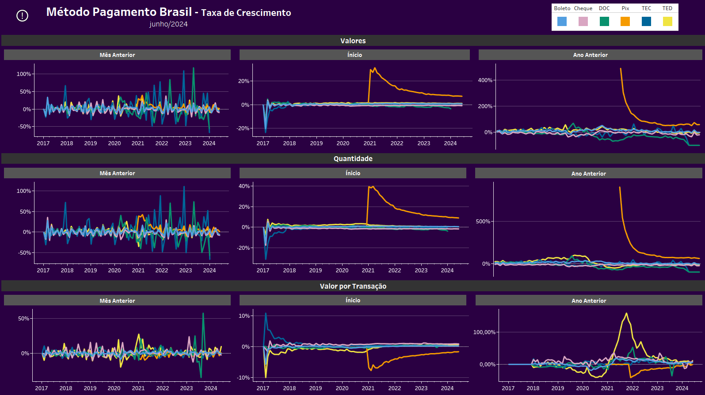
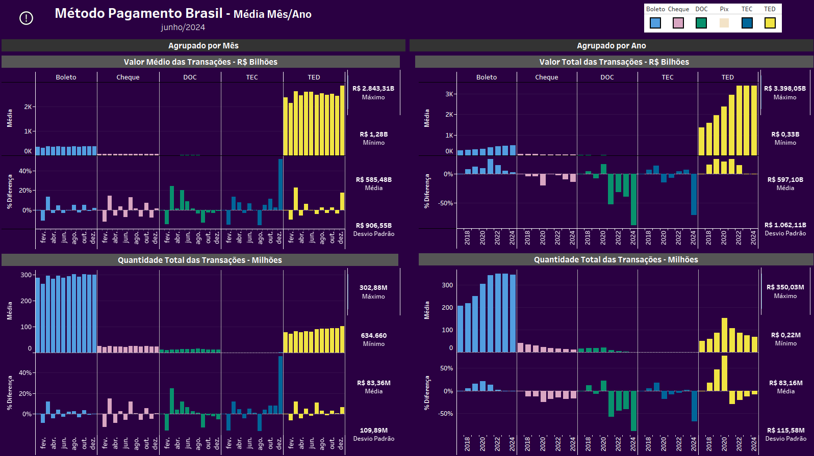
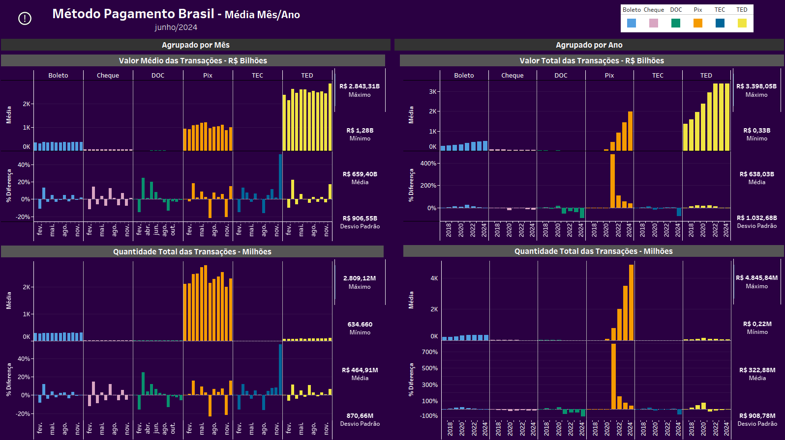
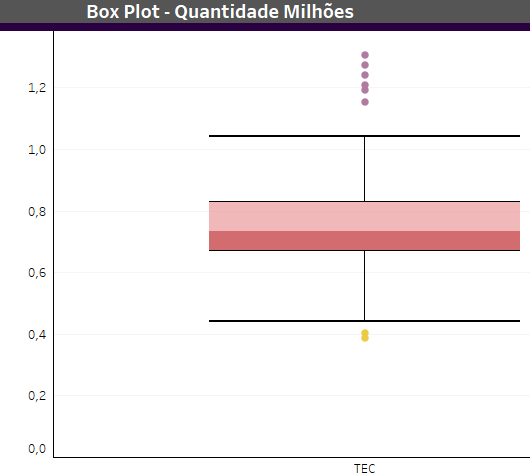
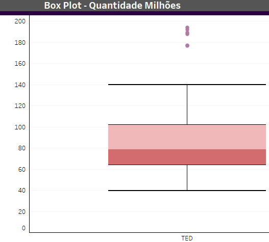
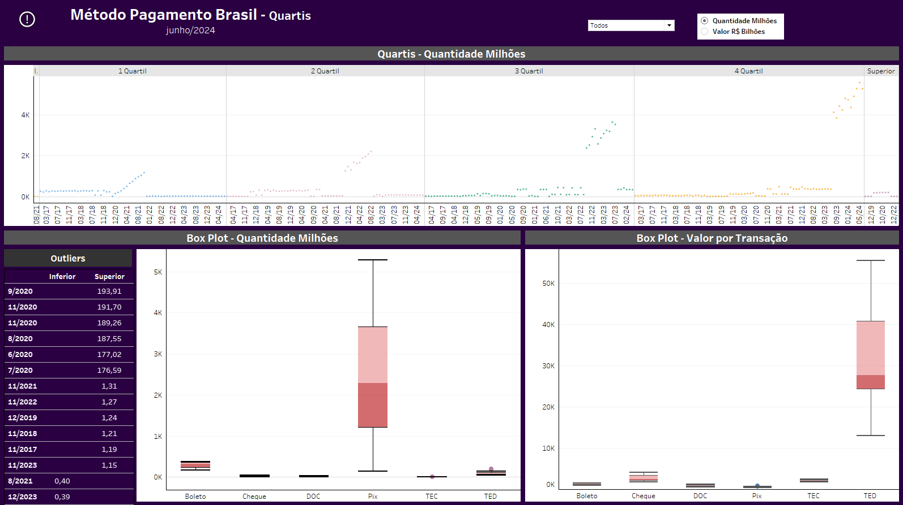
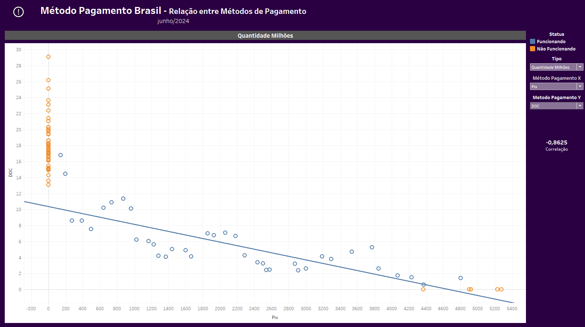

<h1>
    &#128640;Análise Métodos de Pagamento
</h1>

    Fonte:
    <a hef:"https://dadosabertos.bcb.gov.br/dataset/estatisticas-meios-pagamentos">
        Dados Abertos Banco Central do Brasil
    </a>

<h2>
    Métodos de Pagamento
</h2>

    Data: Jan/2017 até Jun/2024

<ul>
    <li>
        <b>TED:</b> Transferência Eletrônica Disponível. Não há limite de valor de transferência.
    </li>
    <li>
        <b>DOC:</b> Documento de Ordem de Crédito. Há um limite de R$ 4.999,99 por operação ou por dia. Descontinuado em Fev/2024.
    </li>
    <li>
        <b>TEC:</b> Transferência Especial de Crédito. Usado somente por empresas para conceder vantagens aos seus colaboradores. Descontinuada em Fev/2024.
    </li>
    <li>
        <b>Boleto:</b> Título de cobrança que funciona como um compromisso de pagamento entre o cliente e o fornecedor. Emitido pela instituição financeira e contém um código de barras (atualmente QR Code foi incluido) que permite o pagamento.
    </li>
    <li>
        <b>Cheque:</b> Funciona como uma ordem de pagamento à vista ao banco, para que este pague um valor ao beneficiário.
    </li>
    <li>
        <b>Pix:</b> Teve ínicio em Nov/2020. Permite a tranferência de valores entre contas de modo instantâneo, em poucos segundos. Para receber ou fazer transferência é necessário o prévio cadastro de uma chave de acesso, que pode ser o CPF, CNPJ, e-mail, número de telefone ou uma chave aleatória. Não há limitação de horário e é gratuito para pessoas físicas, mas pode ser pago para pessoas jurídicas, com custos que variam de acordo com a instituição financeira. 
        Teve uma grande adesão devido a sua flexibilidade de uso. Uma cobrança pode ser emitida pelo próprio usuário sem necessidade de autorização do banco, podendo substituir outros métodos de pagamento e até mesmo o pagamento em dinheiro.
    </li>
</ul>

<h2>
    &#128202; Valores Mensais
</h2>

<ul>
    <li>
        TED apresenta maior valor total (R$ 224T - 72,8%), porém com baixa quantidade de transações (7,76B - 5,47%) quando comparado com o Pix. Possui um alto valor médio por transação (R$ 29K - 80,79%), sendo impulsionado pela gradual descontinuação do TEC e DOC.
    </li>
    <li>
        Pix teve ínicio no meio de Nov/2020 e apresentou grande adesão. Em apenas 4 meses já havia ultrapassado a quantidade de transações dos outros métodos de pagamento e em 7 meses já havia ultrapassado o valor total dos outro métodos, com exceção do TED. 
        Em Jun/2024, 44 meses desde o ínicio, já tinha R$ 45T de valor total, equivalente a 14,69% do total, e 3,5 vezes maior que o valor total do boleto, cheque, TEC e DOC somados contados desde de jan/2017. Possuia 104B de transações, equivalente a 73,7% do total de transações e 2,78 vezes maior que a somatória de todos os outros métodos. 
        Possui baixo valor médio por transação (R$ 433 - 1,2%), sendo bastante utilizado em transações de baixos valores, substituindo transações antes realizadas com boleto, que perdeu a primeira posição de mais utilizado para o Pix.
    </li>
</ul>

<h2>
    &#128200; Taxa de Crescimento
</h2>

<ul>
    <li>
        Após ínicio do Pix, o DOC e TEC apresentaram as maiores variações na taxa de crescimento que compara ao mês anterior devido ao seu uso que foi perdendo relevância e foram utilizados de maneira esporádica.
    </li>
    <li>
        Na taxa de crescimento que compara desde o ínicio (Dez/2020 para Pix e Jan/2017 para o restante), após o Pix, todos os métodos não apresentaram variação positiva acima de 3%. 
        O Pix apresentou um alto crescimento inicial no valor e quantidade total que vem diminuindo gradualmente. Por outro lado, o valor médio por transação do Pix teve uma grande diminuição e continua diminuindo de maneira constante levando a conclusão que o uso para transações de baixo valor está aumentando, substituindo aos poucos as operações antes realizadas com dinheiro.
    </li>
</ul>

<h2>
    &#128197; Média Mês/Ano
</h2>

<ul>
    <li>
        O método TEC é usado somente por empresas para conceder vantagens aos seus colaboradores, o que explica o aumento de 55% no mês de Dezembro.
    </li>
    <li>
        Todos os métodos apresentam um aumento no mês de março decorrente da recuperação após a queda de janeiro e fevereiro, pós-compras de dezembro.
    </li>
    <li>
        Pix apresenta redução acima de 20% em julho e novembro, talvez decorrente das férias escolares e pré-compras de dezembro.
    </li>
    <li>
        Após ínicio do Pix, DOC apresentou grandes reduções ao longo dos anos o que resultou na sua descontinuação.
    </li>
</ul>

<h4>
    Sem Pix
</h4>

<h4>
    Com Pix
</h4>

<h2>
    🆚 Relação Valor x Quantidade
</h2>

<ul>
    <li>
        Boleto apresenta uma grande alteração no modelo tendência depois do Pix, onde o valor possui baixa correlação com a quantidade.
    </li>
    <li>
        TED, após o Pix, apresenta direções do modelo tendência opostas uma a outra e o valor de correlação se tornou muito baixo.
    </li>
</ul>

<h2>
     Quartis">
    Quartis
</h2>

<h4>
    TEC
</h4>

<ul>
    <li>
        Os outliers superiores são dos meses de dezembro.
    </li>
</ul>

<h4>
    TED
</h4>

<ul>
    <li>
        Os outliers superiores são entre julho/2020 e dezembro/2020, período em que foram pagos os benefícios sociais durante a pandemia da Covid-19.
    </li>
</ul>
 

<h2>
    &#128200; Relação entre Métodos de Pagamento
</h2>
