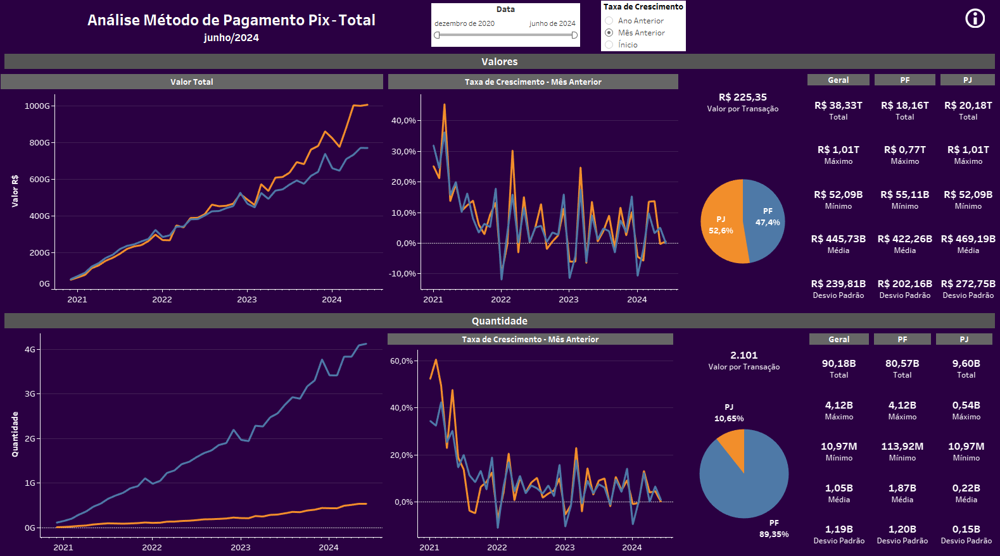
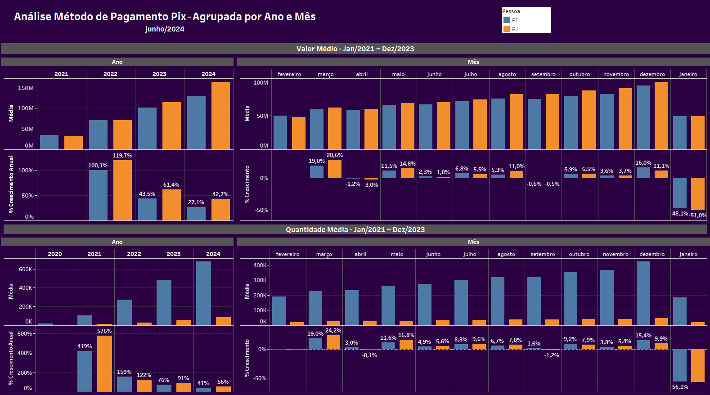
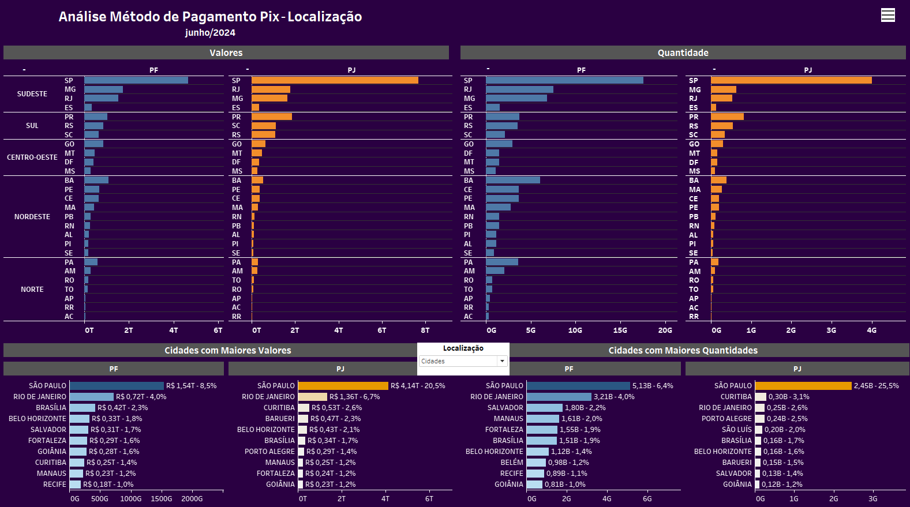
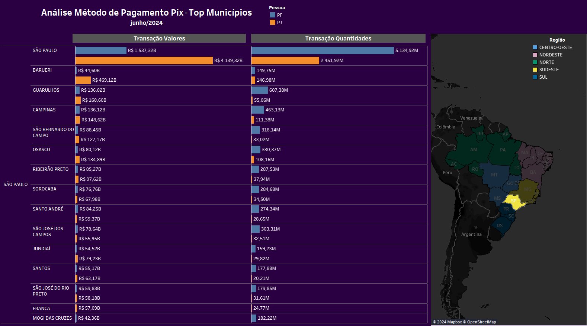
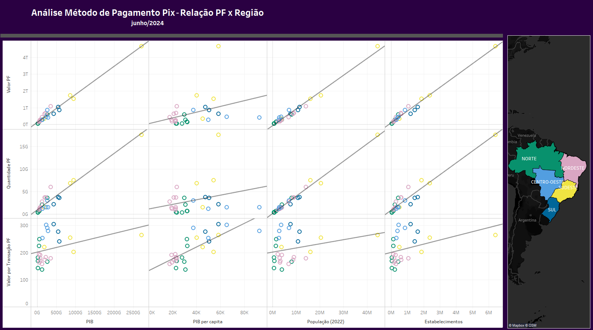
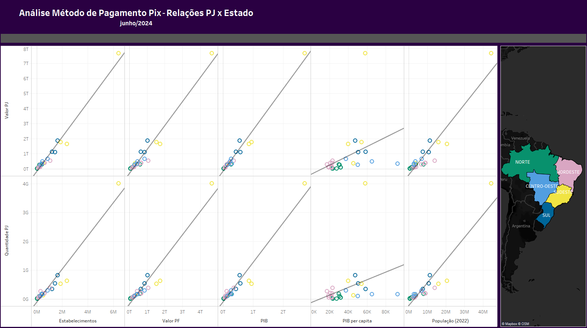
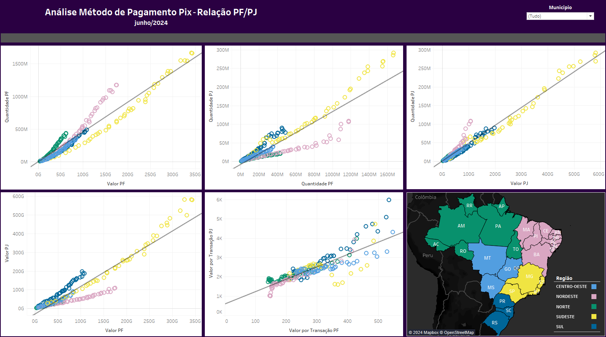

<h1>
    Análise Método de Pagamento Pix
</h1>

    Fonte:
    <a>https://dadosabertos.bcb.gov.br/dataset/pix</a>

<h4>
    Termos-Chave
</h4>
<ul>
    <li>
        Pessoa Física: PF
    </li>
    <li>
        Pessoa Jurídica: PJ
    </li>
</ul>

<h2>
    Total
</h2>

    Possui filtro de data para todos os valores. Taxa de crescimento pode ser comparada pelo mês anterior, pelo mesmo mês no ano anterior e pelo desde o ínicio.

<ul>
    <li>
        As PF realizam 8,4 vezes mais transações do que as PJ, porém o valor total das transações realizadas por PJ é 11% maior que o de PF. Explicando o porque do valor por transação PJ ser 9,3 vezes maior que o valor PF.
    </li>
    <li>
        As maiores quedas na taxa de crescimento são dos meses de janeiro, período pós-compras de dezembro. E os maiores acréscimos são do mês de dezembro, período de compras, e março, recuperação após as quedas de janeiro.
    </li>
</ul>

<h2>
    Agrupada por Ano e Mês
</h2>

<ul>
    <li>
        Maiores valores de crescimento para PF são de março e dezembro, enquanto para PJ são março e maio.
    </li>
    <li>
        Janeiro apresenta grande queda devido o pós-compra de dezembro.
    </li>
</ul>

<h2>
    Agrupados por Localização
</h2>

    Há filtro que permite escolher entre top regiões, estados ou municípíos.

<ul>
    <li>
        São Paulo lidera em valores e quantidades de transações. SP possui 50% do valor total das transações e mais de 40% da quantidade total de transações.
    </li>
</ul>

<h2>
    Top Municípios
</h2>

    Top municípios do estado escolhido no mapa.

<h2>
    Relação PF x Região
</h2>

    Possível filtrar por região com o mapa ao lado.

<h2>
    Relação PJ x Região
</h2>

    Possível filtrar por região com o mapa ao lado.

<h2>
    Relação PF/PJ
</h2>

    Possível filtrar por região, estado ou município com o mapa ao lado e com a lista de municípios.

